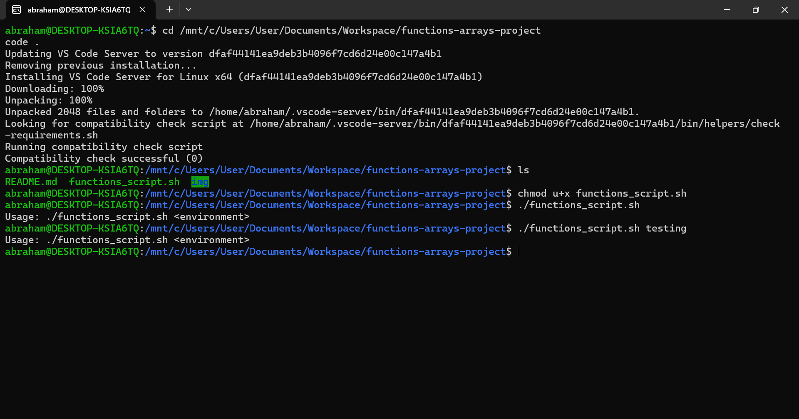

# Working with Functions & Arrays in Shell Scripting

## Project Overview
This project explores functions and arrays in Bash scripting to automate AWS setup for DataWise Solutions, executed on Ubuntu (WSL) with VS Code via Ubuntu.

## Setup
- Created a new GitHub repository and cloned it to ~/Documents/Workspace/functions-arrays-project on Jun 18, 2025, 14:05 PM CAT.
- Used Ubuntu terminal (WSL) with VS Code installed via Ubuntu, accessing /mnt/c/Users/YourUsername/Documents/Workspace/functions-arrays-project.

## Script Execution

### Creating and Implementing Functions & Arrays Script
- **Edit Script with VS Code**:
  - Command: `code functions_script.sh`
  - Purpose: Created a script using functions and arrays for AWS setup.
  - Added code:
    ```bash
    #!/bin/bash

    # This script demonstrates functions and arrays for automating AWS setup
    # Purpose: Manage environment setup and AWS configuration checks

    # Environment variable
    ENVIRONMENT=$1
    # Stores the first argument as the environment type

    # Function to check the number of arguments
    check_num_of_args() {
        # Checking the number of arguments
        if [ "$#" -ne 1 ]; then
            echo "Usage: $0 <environment>"
            exit 1
        fi
    }

    # Function to activate infrastructure environment
    activate_infra_environment() {
        # Acting based on the argument value
        if [ "$ENVIRONMENT" == "local" ]; then
            echo "Running script for Local Environment..."
        elif [ "$ENVIRONMENT" == "testing" ]; then
            echo "Running script for Testing Environment..."
        elif [ "$ENVIRONMENT" == "production" ]; then
            echo "Running script for Production Environment..."
        else
            echo "Invalid environment specified. Please use 'local', 'testing', or 'production'."
            exit 2
        fi
    }

    # Function to check if AWS CLI is installed
    check_aws_cli() {
        if ! command -v aws &> /dev/null; then
            echo "AWS CLI is not installed. Please install it before proceeding."
            return 1
        fi
    }

    # Function to check if AWS profile is set
    check_aws_profile() {
        if [ -z "$AWS_PROFILE" ]; then
            echo "AWS profile environment variable is not set."
            return 1
        fi
    }

    # Array of resources to set up
    declare -a resources=("EC2" "S3")
    # Defines an array of AWS resources to iterate over

    # Function to set up AWS resources
    setup_aws_resources() {
        for resource in "${resources[@]}"; do
            # Loops through each resource in the array
            echo "Setting up $resource for $ENVIRONMENT environment..."
            # Placeholder for actual resource creation
        done
    }

    # Call all functions
    check_num_of_args
    activate_infra_environment
    check_aws_cli
    check_aws_profile
    setup_aws_resources
    ```
  - Purpose: Functions encapsulate logic (e.g., argument checks, environment activation); arrays and loops automate resource setup.
- **Add Execute Permission**:
  - Command: `chmod u+x functions_script.sh`
  - Purpose: Grants execute permission.
- **Run Script**:
  - Command: `./functions_script.sh testing`
  - Purpose: Executes with environment argument; requires AWS CLI and `AWS_PROFILE`.
  - Verification: Checks environment, AWS setup; note errors if dependencies are missing.
  - **Screenshot**: Script execution with output:

    

## Learning Summary
Through this mini project on working with functions and arrays in shell scripting, I gained valuable insights into organizing and automating tasks for DataWise Solutions. I learned to define functions like `check_num_of_args` and `activate_infra_environment` to encapsulate specific logic, improving code readability and reusability by calling them at the script’s end. The use of arrays, such as `resources=("EC2" "S3")`, combined with a `for` loop in `setup_aws_resources`, enabled efficient iteration over multiple AWS resources. Additionally, I implemented checks for AWS CLI installation and profile configuration using `check_aws_cli` and `check_aws_profile`, enhancing script robustness. This experience underscored the importance of modular design and data structures in creating scalable and maintainable scripts.

## Tools Used
- **Ubuntu Terminal (WSL)**: For script execution with VS Code via Ubuntu.
- **VS Code**: For editing the script and `README.md`.
- **Git Bash**: For managing the Git repository on Windows.
- **GitHub**: For hosting the project.

## Repository Link
[GitHub Repository](https://github.com/westgrin/functions-arrays-project)

## Conclusion
This project strengthened my skills in Bash scripting, mastering functions and arrays to automate AWS setup effectively.